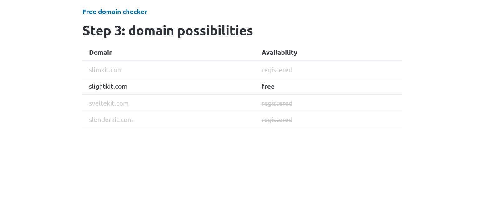

# free-domain-checker

SvelteKit application that generates possible domain names from synonyms of user-provided keywords and checks if they are registered or not.

## Docker

```
docker run -d -p 3000:3000 pieca/free-domain-checker:0.2
```

## local dev

1. Download and unzip WordNet SQLite database from [here](https://sourceforge.net/projects/wnsql/files/wnsql3/sqlite/3.1/).

2. Run

```
DB=<sqlite_file_location> npm run dev
```

3. build docker

```
docker build . -t pieca/free-domain-checker:0.2
```

## App screenshot



## Acknowledgements

For registrered domains the app uses free [Scraper Run Whois API](https://scraper.run/api.html)

Synonyms are generated from [WordNet](https://wordnet.princeton.edu) database:

- [license](https://wordnet.princeton.edu/license-and-commercial-use)
- [sqlite file source](https://wnsql.sourceforge.net/)
- [sourceforge sqlite db link](https://sourceforge.net/projects/wnsql/)
